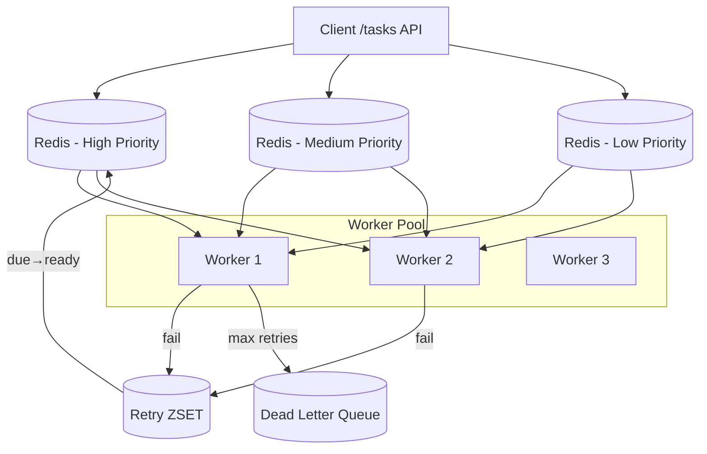
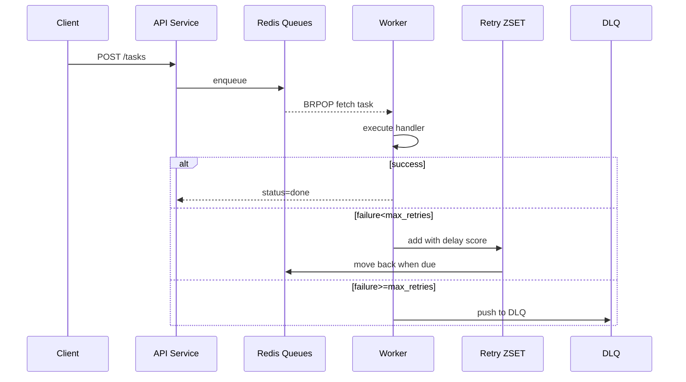

---

# **Distributed Task Queue Architecture**

This document describes the architecture of the high-concurrency distributed task queue system implemented in this repository.
It supports retry, exponential backoff, DLQ, priority queues, metrics, autoscaling hints, and worker pools.

---

## **1. High-Level Architecture**



---

## **2. Component Overview**

### **API Service**

* Accepts task submission (`POST /tasks`).
* Validates payload + business key.
* Enqueues into appropriate priority queue.
* Exposes:

  * `/tasks/{id}`
  * `/dlq`
  * `/health`

---

### **Worker Service**

The worker pool:

1. BRPOP from high → medium → low priority queues.
2. Execute task handler with structured logging.
3. If fail:

   * Increase retry_count
   * Move to Retry ZSET with score = now + backoff
4. If retry exceeds `max_retries`, push to DLQ.

Backoff uses:

```
delay = base_delay * 2^retry_count
```

---

### **Scheduler Service**

A lightweight periodic scanner:

* Reads due entries from Retry ZSET
* Moves them back to the appropriate LIST queue
* Updates metrics: number of retries, queue depth

Runs every **500ms–1s** (configurable).

---

### **Redis Usage**

* **LIST** → main task queues
* **ZSET** → retry mechanism
* **HASH** (optional) → business_key → task_id (幂等性)

---

### **Metrics (Prometheus)**

Exposed metrics:

* `enqueue_total`
* `retry_total`
* `fail_total`
* `task_processing_seconds_bucket`
* API latency histogram
* Queue depth (high/medium/low)

---

## **3. Task Execution Flow**



---

## **4. Directory Structure**

```
services/
  api/
  worker/
  scheduler/
libs/
  queue/
  metrics/
  backoff/
  logging/
infra/
docker/
tests/
scripts/
```

---

## **5. Autoscaling Suggestion Protocol**

Based on queue backlog:

| Backlog  | Suggest replicas |
| -------- | ---------------- |
| < 100    | 1–2              |
| 100–500  | 3                |
| 500–2000 | 4                |
| >2000    | 6                |

Exposed via:

```
GET /autoscale/suggest
```

---

## **6. Future Extensions**

* Switch Redis → Kafka + Consumer Groups
* Worker categories + isolation
* SLA-aware scheduling
* Distributed tracing (OpenTelemetry)
* Distributed locks for task dedupe
* Multi-region failover

---
